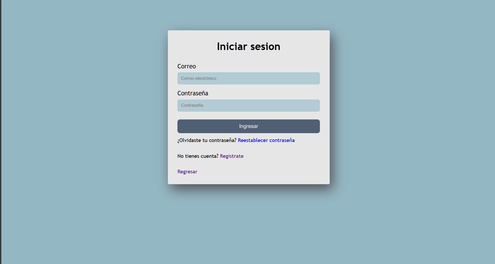

# Proyecto Web de Noticias

## Equipo de Desarrollo

- Apodaca Caixba Raquel
- Carillo Avilez Jesus Arturo
- Castillo Inzunza Ernesto
- Gomez Cazares Sergio Antonio
- Quintero Mata Victor Adrian
- Romero Corral Carlos Alberto
- Zavala Martinez Bryan Tadeo

---

## Tabla de Contenidos

- [Definición del Proyecto](#definición-del-proyecto)
- [Justificación](#justificación)
- [Descripción del Sistema](#descripción-del-sistema)
- [Objetivos](#objetivos)
- [Principales Funcionalidades](#principales-funcionalidades)
- [Requisitos](#requisitos)
- [Actores Principales](#actores-principales)
- [Diagramas de Casos de Uso](#diagramas-de-casos-de-uso)
- [Especificación de Casos de Uso](#especificación-de-casos-de-uso)
- [Modelo de Datos](#modelo-de-datos)
- [Arquitectura del Sistema](#arquitectura-del-sistema)
- [Diseño de Interfaz](#diseño-de-interfaz)
- [Estructura del Proyecto](#estructura-del-proyecto)
- [Instalación y Configuración](#instalación-y-configuración)
- [Tecnologías Utilizadas](#tecnologías-utilizadas)

---

## Definición del Proyecto

El proyecto consiste en el desarrollo de una **Página Web de Noticias** que permite a periodistas o redactores publicar artículos, mientras que los usuarios registrados podrán iniciar sesión para comentar, guardar noticias y personalizar su experiencia.

El sistema gestionará la publicación, edición y clasificación de noticias, así como el acceso autenticado de usuarios y administradores.

---

## Justificación

En la actualidad, la mayoría de las personas acceden a la información por medios digitales. Por ello, contar con una página web de noticias permite ofrecer contenido actualizado, accesible desde cualquier lugar y dispositivo, fomentando la participación ciudadana y combatiendo la desinformación mediante fuentes confiables.

---

## Descripción del Sistema

El sistema permitirá a administradores y redactores crear y gestionar noticias, editar contenido, asignar categorías y moderar comentarios.

### Funcionalidades para usuarios:
- Registrarse e iniciar sesión
- Comentar noticias
- Reaccionar a contenido
- Guardar noticias
- Personalizar preferencias

### Características del sistema:
- Portal público con noticias visibles para todos
- Panel de administración con roles
- Sistema de login y registro
- Buscador y filtros de noticias
- Sistema de comentarios
- Supervisión de noticias por administradores

---

## Objetivos

### Objetivo General
Desarrollar una página web de noticias con autenticación y un panel de administración que permita gestionar artículos, usuarios y comentarios de forma eficiente, segura y estructurada.

### Objetivos Específicos
- Permitir a redactores publicar, editar y eliminar noticias
- Clasificar noticias por categorías y etiquetas
- Registrar usuarios con roles diferenciados
- Implementar un login seguro
- Permitir comentarios y reacciones a noticias
- Facilitar la búsqueda de noticias por filtros
- Optimizar la experiencia del usuario mediante preferencias personalizadas
- Mantener un historial de actividades y publicaciones

---

## Principales Funcionalidades

| Funcionalidad | Descripción |
|--------------|-------------|
| **Gestión de Noticias** | Crear, editar, eliminar y publicar noticias clasificadas |
| **Login y Registro** | Autenticación segura con roles diferenciados |
| **Gestión de Usuarios** | Administrar usuarios, roles, permisos y estado |
| **Comentarios** | Usuarios registrados pueden comentar noticias |
| **Guardado de Noticias** | Usuarios pueden guardar noticias para leer después |
| **Búsqueda y Filtros** | Buscar por título, categoría, fecha, etiqueta, etc. |
| **Panel Administrativo** | Vista exclusiva para admins y redactores |
| **Notificaciones** | Para nuevas noticias o respuestas a comentarios |

---

## Requisitos

### Requisitos Funcionales (RF)

| Clave | Descripción |
|-------|-------------|
| **RF-01** | El sistema debe permitir a los administradores y redactores crear nuevas noticias con título, contenido, imágenes y categoría |
| **RF-02** | El sistema debe permitir registrar usuarios con correo, contraseña y rol |
| **RF-03** | El sistema debe permitir a los usuarios iniciar sesión mediante validación segura |
| **RF-04** | El sistema debe permitir a los usuarios logueados comentar noticias |
| **RF-05** | El sistema debe permitir a los usuarios logueados guardar noticias |
| **RF-06** | El sistema debe permitir filtrar noticias por categoría, fecha, popularidad o autor |
| **RF-07** | El sistema debe permitir al administrador gestionar usuarios (activar, desactivar, cambiar rol) |
| **RF-08** | El sistema debe mostrar noticias ordenadas por fecha de publicación |
| **RF-09** | El sistema debe permitir a los redactores editar y actualizar noticias existentes |
| **RF-10** | El sistema debe enviar notificaciones a los usuarios si hay nuevas noticias de sus categorías favoritas |

### Requisitos No Funcionales (RNF)

| Clave | Descripción |
|-------|-------------|
| **RNF-01** | El sistema debe ser responsivo y usable desde dispositivos móviles |
| **RNF-02** | Las páginas deben cargar en menos de 2 segundos |
| **RNF-03** | Contraseñas encriptadas y acceso seguro mediante HTTPS |
| **RNF-04** | Soporte para navegadores modernos |
| **RNF-05** | Escalabilidad para soportar hasta 50,000 usuarios |
| **RNF-06** | Sistema siempre disponible un 99% del tiempo |
| **RNF-07** | Panel intuitivo y accesible para redactores sin experiencia técnica |

---

## Actores Principales

| Actor | Descripción |
|-------|-------------|
| **Administrador** | Control total sobre usuarios, roles y contenido |
| **Redactor (Editor)** | Publica, edita y gestiona noticias |
| **Usuario Registrado** | Puede comentar, reaccionar y guardar noticias |
| **Visitante** | Solo puede ver noticias públicamente |
| **Sistema de Notificaciones** | Envía alertas a usuarios registrados |

---


## Especificación de Casos de Uso

### CU-01: Registro de Usuario

| Campo | Descripción |
|-------|-------------|
| **Número** | CU-01 |
| **Nombre** | Registro de Usuario |
| **Descripción** | Permite que un visitante cree una cuenta proporcionando correo y contraseña |
| **Actor(es)** | Visitante |
| **Precondición** | El usuario no debe existir previamente |
| **Postcondición** | El usuario queda registrado |

**Flujo Normal:**

| Paso | Actor | Paso | Sistema |
|------|-------|------|---------|
| 1 | El usuario accede a la página web | 2 | El sistema muestra la página principal |
| 3 | El usuario accede al botón de "registrar" | 4 | El sistema muestra el formulario de registro |
| 5 | El usuario ingresa correo y contraseña | 6 | El sistema valida los datos |
| | | 7 | El sistema registra la cuenta y muestra mensaje de confirmación |

**Flujo Alternativo:**

| Paso | Actor | Paso | Sistema |
|------|-------|------|---------|
| | | 6.1 | Si los datos son incorrectos, el sistema muestra error y regresa al paso 5 |
| | | 7.1 | Si el correo ya existe, el sistema indica error y solicita usar otro |

---

### CU-02: Iniciar Sesión

| Campo | Descripción |
|-------|-------------|
| **Número** | CU-02 |
| **Nombre** | Iniciar Sesión |
| **Descripción** | Permite que usuarios registrados accedan al sistema |
| **Actor(es)** | Usuario Registrado / Redactor / Administrador |
| **Precondición** | El usuario debe existir en el sistema |
| **Postcondición** | El usuario queda autenticado |

**Flujo Normal:**

| Paso | Actor | Paso | Sistema |
|------|-------|------|---------|
| 1 | El usuario accede a la página web | 2 | El sistema muestra la página principal |
| 3 | El usuario accede al botón de "Iniciar sesión" | 4 | El sistema muestra el formulario de login |
| 5 | El usuario ingresa correo y contraseña | 6 | El sistema valida los datos |
| | | 7 | El sistema concede acceso y muestra el panel correspondiente |

**Flujo Alternativo:**

| Paso | Actor | Paso | Sistema |
|------|-------|------|---------|
| | | 6.1 | Si los datos son incorrectos, se muestra error y regresa al paso 5 |
| | | 7.1 | Si la cuenta está desactivada, se deniega el acceso |

---

### CU-03: Publicar Noticia

| Campo | Descripción |
|-------|-------------|
| **Número** | CU-03 |
| **Nombre** | Publicar Noticia |
| **Descripción** | El redactor crea una nueva noticia con información completa |
| **Actor(es)** | Redactor / Administrador |
| **Precondición** | Debe haber iniciado sesión con permisos |
| **Postcondición** | La noticia queda publicada |

**Flujo Normal:**

| Paso | Actor | Paso | Sistema |
|------|-------|------|---------|
| 1 | El usuario accede al panel de "Noticias" | 2 | El sistema muestra el panel de noticias |
| 3 | Selecciona "Crear noticia" | 4 | El sistema muestra el formulario |
| 5 | El usuario ingresa título, contenido e imágenes | 6 | El sistema valida los datos |
| 7 | El usuario presiona "Publicar noticia" | 8 | El sistema registra y publica la noticia |

**Flujo Alternativo:**

| Paso | Actor | Paso | Sistema |
|------|-------|------|---------|
| | | 6.1 | Si faltan datos, se solicita completarlos |
| | | 6.2 | Si la imagen es inválida, solicita corregir |

---

### CU-04: Comentar Noticia

| Campo | Descripción |
|-------|-------------|
| **Número** | CU-04 |
| **Nombre** | Comentar Noticia |
| **Descripción** | El usuario registrado puede comentar una noticia |
| **Actor(es)** | Usuario Registrado |
| **Precondición** | Estar autenticado y que la noticia exista |
| **Postcondición** | El comentario queda publicado |

**Flujo Normal:**

| Paso | Actor | Paso | Sistema |
|------|-------|------|---------|
| 1 | El usuario da click a la noticia | 2 | El sistema muestra la noticia y los comentarios |
| 3 | El usuario escribe un comentario | 4 | El sistema recibe el comentario |
| 5 | El usuario da click en "confirmar envío" | 6 | El sistema lo registra y muestra |

**Flujo Alternativo:**

| Paso | Actor | Paso | Sistema |
|------|-------|------|---------|
| | | 3.1 | Si el comentario está vacío, se solicita ingresar texto |
| | | 1.1 | Si no ha iniciado sesión, se pide autenticación |

---

### CU-05: Guardar Noticia

| Campo | Descripción |
|-------|-------------|
| **Número** | CU-05 |
| **Nombre** | Guardar Noticia |
| **Descripción** | Permite guardar una noticia para leer después |
| **Actor(es)** | Usuario Registrado |
| **Precondición** | Usuario autenticado |
| **Postcondición** | La noticia queda guardada |

**Flujo Normal:**

| Paso | Actor | Paso | Sistema |
|------|-------|------|---------|
| 1 | El usuario da click a la noticia | 2 | El sistema muestra la noticia y la opción "Guardar" |
| 3 | El usuario selecciona "Guardar" | 4 | El sistema registra la noticia en su lista |

**Flujo Alternativo:**

| Paso | Actor | Paso | Sistema |
|------|-------|------|---------|
| | | 3.1 | Si ya estaba guardada, informa duplicado |
| | | 1.1 | Si no está autenticado, solicita iniciar sesión |

---

### CU-06: Administrar Usuarios

| Campo | Descripción |
|-------|-------------|
| **Número** | CU-06 |
| **Nombre** | Administrar Usuarios |
| **Descripción** | El administrador gestiona roles y estados de usuarios |
| **Actor(es)** | Administrador |
| **Precondición** | Iniciar sesión con rol administrador |
| **Postcondición** | El usuario queda actualizado |

**Flujo Normal:**

| Paso | Actor | Paso | Sistema |
|------|-------|------|---------|
| 1 | El administrador accede al panel de usuarios | 2 | El sistema muestra la lista |
| 3 | El administrador selecciona un usuario | 4 | El sistema muestra opciones de gestión |
| 5 | El administrador aplica cambios (activar, desactivar o cambiar rol) | 6 | El sistema actualiza los datos |

**Flujo Alternativo:**

| Paso | Actor | Paso | Sistema |
|------|-------|------|---------|
| | | 3.1 | Si el usuario no existe, informa error |
| | | 5.1 | Si el rol es inválido, rechaza la acción |

---

### CU-07: Editar Noticia

| Campo | Descripción |
|-------|-------------|
| **Número** | CU-07 |
| **Nombre** | Editar Noticia |
| **Descripción** | Permite modificar una noticia existente |
| **Actor(es)** | Redactor / Administrador |
| **Precondición** | Estar autenticado y que la noticia exista |
| **Postcondición** | La noticia queda actualizada |

**Flujo Normal:**

| Paso | Actor | Paso | Sistema |
|------|-------|------|---------|
| 1 | El usuario accede al panel de noticias | 2 | El sistema muestra listado |
| 3 | El usuario selecciona la noticia | 4 | El sistema carga la información |
| 5 | El usuario realiza cambios y confirma | 6 | El sistema actualiza la noticia |

**Flujo Alternativo:**

| Paso | Actor | Paso | Sistema |
|------|-------|------|---------|
| | | 5.1 | Si faltan datos, solicita completar |
| | | 6.1 | Si imagen es inválida, rechaza actualización |

---

### CU-08: Eliminar Noticia

| Campo | Descripción |
|-------|-------------|
| **Número** | CU-08 |
| **Nombre** | Eliminar Noticia |
| **Descripción** | El usuario autorizado puede eliminar una noticia |
| **Actor(es)** | Redactor / Administrador |
| **Precondición** | Estar autenticado |
| **Postcondición** | La noticia queda eliminada |

**Flujo Normal:**

| Paso | Actor | Paso | Sistema |
|------|-------|------|---------|
| 1 | El usuario selecciona noticia a eliminar | 2 | El sistema solicita confirmación |
| 3 | El usuario confirma la eliminación | 4 | El sistema elimina la noticia |

**Flujo Alternativo:**

| Paso | Actor | Paso | Sistema |
|------|-------|------|---------|
| | | 3.1 | Si cancela, no se elimina nada |

---

### CU-10: Buscar Noticias

| Campo | Descripción |
|-------|-------------|
| **Número** | CU-10 |
| **Nombre** | Buscar Noticias |
| **Descripción** | Permite buscar noticias por palabras clave |
| **Actor(es)** | Usuario Registrado / Visitante |
| **Precondición** | Deben existir noticias |
| **Postcondición** | Se muestran resultados filtrados |

**Flujo Normal:**

| Paso | Actor | Paso | Sistema |
|------|-------|------|---------|
| 1 | El usuario escribe término de búsqueda | 2 | El sistema procesa búsqueda |
| | | 3 | El sistema muestra resultados |

**Flujo Alternativo:**

| Paso | Actor | Paso | Sistema |
|------|-------|------|---------|
| | | 3.1 | Si no hay resultados, muestra aviso |

---

### CU-11: Filtrar Noticias

| Campo | Descripción |
|-------|-------------|
| **Número** | CU-11 |
| **Nombre** | Filtrar Noticias |
| **Descripción** | Permite filtrar noticias por categoría, etiqueta o autor |
| **Actor(es)** | Usuario Registrado / Visitante |
| **Precondición** | Noticias categorizadas |
| **Postcondición** | Noticias filtradas visibles |

**Flujo Normal:**

| Paso | Actor | Paso | Sistema |
|------|-------|------|---------|
| 1 | El usuario selecciona un filtro | 2 | El sistema aplica filtro |
| | | 3 | El sistema muestra noticias filtradas |

**Flujo Alternativo:**

| Paso | Actor | Paso | Sistema |
|------|-------|------|---------|
| | | 3.1 | Si no hay coincidencias, muestra mensaje |

---

### CU-12: Recibir Notificaciones

| Campo | Descripción |
|-------|-------------|
| **Número** | CU-12 |
| **Nombre** | Recibir Notificaciones |
| **Descripción** | El sistema envía notificaciones al usuario sobre nuevas noticias o respuestas |
| **Actor(es)** | Sistema / Usuario Registrado |
| **Precondición** | Usuario con notificaciones activas |
| **Postcondición** | El usuario queda informado |

**Flujo Normal:**

| Paso | Sistema |
|------|---------|
| 1 | Detecta evento relevante |
| 2 | Genera notificación |
| 3 | La envía al usuario |

**Flujo Alternativo:**

| Paso | Sistema |
|------|---------|
| 2.1 | Si las notificaciones están desactivadas, no se envía nada |

---

### CU-13: Personalizar Preferencias

| Campo | Descripción |
|-------|-------------|
| **Número** | CU-13 |
| **Nombre** | Personalizar Preferencias |
| **Descripción** | El usuario configura categorías favoritas y opciones |
| **Actor(es)** | Usuario Registrado |
| **Precondición** | Estar autenticado |
| **Postcondición** | Preferencias actualizadas |

**Flujo Normal:**

| Paso | Actor | Paso | Sistema |
|------|-------|------|---------|
| 1 | El usuario accede a configuraciones | 2 | El sistema muestra opciones disponibles |
| 3 | El usuario selecciona preferencias | 4 | El sistema guarda la configuración |

**Flujo Alternativo:**

| Paso | Actor | Paso | Sistema |
|------|-------|------|---------|
| | | 3.1 | Si datos son inválidos, solicita corregir |

---

### CU-14: Agregar Comentario

| Campo | Descripción |
|-------|-------------|
| **Número** | CU-14 |
| **Nombre** | Agregar Comentario |
| **Descripción** | Permite que un usuario cree un nuevo comentario |
| **Actor(es)** | Usuario Registrado |
| **Precondición** | La noticia debe existir |
| **Postcondición** | Comentario añadido |

**Flujo Normal:**

| Paso | Actor | Paso | Sistema |
|------|-------|------|---------|
| 1 | El usuario abre una noticia | 2 | El sistema muestra sección de comentarios |
| 3 | El usuario escribe el comentario | 4 | El sistema registra el contenido |
| 5 | El usuario confirma comentario | 6 | El sistema publica y muestra el comentario |

**Flujo Alternativo:**

| Paso | Actor | Paso | Sistema |
|------|-------|------|---------|
| | | 3.1 | Si está vacío, solicita texto |
| | | 1.1 | Si no ha iniciado sesión, pide autenticación |

---

### CU-15: Editar Comentario

| Campo | Descripción |
|-------|-------------|
| **Número** | CU-15 |
| **Nombre** | Editar Comentario |
| **Descripción** | Permite modificar un comentario propio |
| **Actor(es)** | Usuario Registrado |
| **Precondición** | Ser autor del comentario |
| **Postcondición** | Comentario actualizado |

**Flujo Normal:**

| Paso | Actor | Paso | Sistema |
|------|-------|------|---------|
| 1 | El usuario accede a una noticia | 2 | El sistema muestra comentarios |
| 3 | El usuario selecciona "Editar" | 4 | El sistema carga contenido editable |
| 5 | El usuario realiza cambios y confirma | 6 | El sistema actualiza comentario |

**Flujo Alternativo:**

| Paso | Actor | Paso | Sistema |
|------|-------|------|---------|
| | | 3.1 | Si no es autor, rechaza acción |
| | | 5.1 | Si queda vacío, solicita contenido |

---

### CU-16: Eliminar Comentario

| Campo | Descripción |
|-------|-------------|
| **Número** | CU-16 |
| **Nombre** | Eliminar Comentario |
| **Descripción** | Permite al usuario eliminar su propio comentario |
| **Actor(es)** | Usuario Registrado |
| **Precondición** | Ser autor del comentario |
| **Postcondición** | Comentario eliminado |

**Flujo Normal:**

| Paso | Actor | Paso | Sistema |
|------|-------|------|---------|
| 1 | El usuario da click en una noticia | 2 | El sistema muestra comentarios |
| 3 | El usuario selecciona "Eliminar" | 4 | El sistema solicita confirmación |
| 5 | El usuario confirma eliminación | 6 | El sistema elimina el comentario |

**Flujo Alternativo:**

| Paso | Actor | Paso | Sistema |
|------|-------|------|---------|
| | | 3.1 | Si no es autor, rechaza acción |
| | | 5.1 | Si cancela, no elimina nada |

---

## Modelo de Datos

### Entidades y Atributos

#### Usuario
- `id` (PK)
- `usuario`
- `fecha_nac`
- `correo`
- `contraseña`
- `rol`
- `perfil`
- `sobre_mi`

#### Noticia
- `id_noticia` (PK)
- `titulo`
- `noticia`
- `nombre_periodista`
- `fecha_de_publicacion`
- `hora_de_publicacion`
- `id_periodista` (FK)
- `imagen`

#### Comentario
- `id_comentario` (PK)
- `comentario`
- `usuario`
- `id_usuario` (FK)
- `id_noticia` (FK)
- `fecha_de_comentario`
- `hora_de_comentario`
- `fecha_de_actualizacion_del_comentario`

#### Sesión
- `id_sesion` (PK)
- `fecha_sesion`
- `hora_sesion`
- `id_usuario` (FK)

#### Tag
- `id` (PK)
- `nombre`

### Relaciones y Cardinalidades

#### Usuario — Noticia
- **Relación:** crea / publica
- **Cardinalidad:** Usuario `1` → `0..*` Noticia
- **Interpretación:** Un usuario puede crear muchas noticias, pero una noticia solo pertenece a un usuario

#### Noticia — Comentario
- **Relación:** tiene
- **Cardinalidad:** Noticia `1` → `0..*` Comentario
- **Interpretación:** Una noticia puede tener muchos comentarios

#### Usuario — Comentario
- **Relación:** escribe
- **Cardinalidad:** Usuario `1` → `0..*` Comentario
- **Interpretación:** Un usuario puede escribir muchos comentarios

#### Usuario — Sesión
- **Relación:** inicia
- **Cardinalidad:** Usuario `1` → `0..*` Sesión
- **Interpretación:** Un usuario puede tener múltiples sesiones

#### Noticia — Tag
- **Relación:** clasifica / tiene
- **Cardinalidad:** Noticia `0..*` ↔ `0..*` Tag (Muchos a Muchos)
- **Interpretación:** Una noticia puede tener varios tags y un tag puede estar asociado a varias noticias

### Diagrama Entidad-Relación


---

## Arquitectura del Sistema

El sistema está basado en una **arquitectura cliente–servidor**, donde las responsabilidades se dividen entre el cliente (frontend) y el servidor (backend), permitiendo una comunicación eficiente y escalable.

### 1. Cliente (Frontend)

La capa cliente es responsable de la interfaz de usuario y la interacción con el sistema.

**Tecnologías utilizadas:**
- **React:** para la construcción de interfaces dinámicas y reutilizables
- **JavaScript:** para la lógica del lado del cliente
- **CSS:** para el diseño y estilo visual de la aplicación

**Funciones principales:**
- Visualización de noticias
- Autenticación de usuarios
- Creación y visualización de comentarios
- Búsqueda de noticias por etiquetas
- Comunicación con el servidor mediante peticiones HTTP

### 2. Servidor (Backend)

El servidor implementa la lógica de negocio y actúa como intermediario entre el cliente y la base de datos.

**Tecnologías utilizadas:**
- **Node.js:** entorno de ejecución del lado del servidor
- **JavaScript:** lenguaje principal para el desarrollo del backend
- **Express.js:** para la creación de APIs REST

**Funciones principales:**
- Gestión de usuarios y sesiones
- Autenticación y autorización
- Publicación y administración de noticias
- Gestión de comentarios y etiquetas
- Procesamiento de solicitudes del cliente
- Acceso y manipulación de datos

### 3. Base de Datos

La capa de datos se encarga del almacenamiento persistente de la información del sistema.

**Tecnología utilizada:**
- **MySQL:** sistema de gestión de bases de datos relacional

**Tablas principales:**
- Usuarios
- Noticias
- Comentarios
- Sesiones
- Etiquetas (Tags)
- Relaciones entre noticias y etiquetas

### 4. Comunicación Cliente–Servidor

La comunicación entre el frontend y el backend se realiza mediante:
- **HTTP/HTTPS**
- **API REST**
- Intercambio de datos en formato **JSON**

---

## Diseño de Interfaz

El diseño de las interfaces se realizó en Figma. A continuación se muestran las principales pantallas del sistema:

### Página Principal


### Página de Login


### Página de Registro


### Panel de Administración


### Vista de Noticia


> **Nota:** Coloca las capturas de pantalla de Figma en la carpeta `docs/images/`

---

## Estructura del Proyecto

```
Proyectochido/
│
├── backend/
│   ├── imagenes/
│   ├── node_modules/
│   ├── perfiles/
│   ├── package.json
│   ├── package-lock.json
│   └── server.js
│
├── frontend/
│   ├── public/
│   │   ├── imagenes/
│   │   │   └── logo.png
│   │   ├── favicon.ico
│   │   ├── index.html
│   │   ├── logo192.png
│   │   ├── logo512.png
│   │   ├── manifest.json
│   │   └── robots.txt
│   │
│   ├── src/
│   │   ├── css/
│   │   │   ├── CambiarContrasena.css
│   │   │   ├── CrearNoticia.css
│   │   │   ├── Login.css
│   │   │   ├── LogNoticias.css
│   │   │   ├── LogUsuarios.css
│   │   │   ├── NoticiaPlantilla.css
│   │   │   ├── Pagina-error.css
│   │   │   └── PanelAdmin.css
│   │   │
│   │   ├── imagenes/
│   │   │   ├── 1_.mp4
│   │   │   ├── Banner.png
│   │   │   └── Banner2.png
│   │   │
│   │   ├── javascript/
│   │   │   ├── CambiarContrasena.js
│   │   │   ├── CrearNoticia.js
│   │   │   ├── Error404.js
│   │   │   ├── Login.js
│   │   │   ├── LogNoticias.js
│   │   │   ├── LogUsuarios.js
│   │   │   ├── NoticiaPlantilla.js
│   │   │   ├── PanelAdmin.js
│   │   │   ├── PerfilPlantilla.js
│   │   │   ├── Principal.js
│   │   │   ├── Registrar.js
│   │   │   ├── Reset.js
│   │   │   ├── SobreNosotros.js
│   │   │   ├── ValidarLogin.js
│   │   │   └── ValidarUsuario.js
│   │   │
│   │   ├── App.css
│   │   ├── App.js
│   │   ├── App.test.js
│   │   ├── index.css
│   │   ├── index.js
│   │   ├── logo.svg
│   │   ├── reportWebVitals.js
│   │   └── setupTests.js
│   │
│   ├── .env
│   ├── .gitignore
│   ├── package.json
│   └── package-lock.json
│
├── docs/
│   └── images/
│       ├── diagrama-casos-uso.png
│       ├── diagrama-er.png
│       ├── figma-home.png
│       ├── figma-login.png
│       ├── figma-registro.png
│       ├── figma-admin.png
│       └── figma-noticia.png
│
├── .env
├── .gitignore
├── .gitattributes
└── README.md
```

---

## Instalación y Configuración

### Requisitos Previos

- Node.js (versión recomendada: LTS)
- XAMPP (para MySQL)
- Navegador web moderno

### Paso 1: Instalar Node.js

1. Descarga Node.js desde [https://nodejs.org/es/download](https://nodejs.org/es/download)
2. Descarga el instalador `.msi` para arquitectura de 64 bits
3. Durante la instalación, asegúrate de marcar la opción "Add to PATH"
4. Completa la instalación

### Verificar instalación de Node.js

Abre una terminal y ejecuta:

```bash
node -v
npm -v
```

#### Solución de problemas (Windows)

Si aparece un error relacionado con la ejecución de scripts en PowerShell:

1. Presiona `Windows + R`
2. Escribe `gpedit.msc` y presiona Enter
3. Navega a: **Plantillas administrativas → Componentes de Windows → PowerShell**
4. Selecciona **"Activar la ejecución de scripts"**
5. Click derecho → **Editar**
6. Selecciona **"Habilitada"**
7. En opciones, elige: **Directiva de ejecución → "Permitir todos los scripts"**
8. Click en **Aplicar** y luego **Aceptar**
9. Reinicia Visual Studio Code o tu terminal

### Paso 2: Instalar y Configurar XAMPP

1. Descarga XAMPP desde su [página oficial](https://www.apachefriends.org/)
2. Instala XAMPP
3. Abre el panel de control de XAMPP
4. Inicia únicamente el módulo **MySQL**

### Paso 3: Crear la Base de Datos

1. Accede a [http://localhost/phpmyadmin](http://localhost/phpmyadmin)
2. Ve al apartado **SQL**
3. Crea la base de datos ejecutando:

```sql
CREATE DATABASE Prueba;
```

4. Selecciona la base de datos `Prueba`
5. En el apartado **SQL**, ejecuta el siguiente script:

```sql
SET SQL_MODE = "NO_AUTO_VALUE_ON_ZERO";
START TRANSACTION;
SET time_zone = "+00:00";

-- Crear tabla de comentarios
CREATE TABLE `comentarios` (
  `id_comentario` int(11) NOT NULL,
  `comentario` text DEFAULT NULL,
  `usuario` varchar(50) DEFAULT NULL,
  `id_usuario` int(11) NOT NULL,
  `id_noticia` int(11) NOT NULL,
  `fecha_de_comentario` date NOT NULL,
  `hora_de_comentario` time NOT NULL,
  `fecha_de_actualizacion_del_comentario` timestamp NULL DEFAULT NULL
);

-- Crear tabla de noticias
CREATE TABLE `noticias` (
  `id_noticia` int(11) NOT NULL,
  `titulo` varchar(255) NOT NULL,
  `noticia` text NOT NULL,
  `id_periodista` int(11) NOT NULL,
  `nombre_periodista` varchar(255) NOT NULL,
  `fecha_de_publicacion` date DEFAULT NULL,
  `hora_de_publicacion` timestamp NOT NULL DEFAULT current_timestamp() ON UPDATE current_timestamp(),
  `imagen` varchar(255) DEFAULT NULL
);

-- Crear tabla de sesiones
CREATE TABLE `sesion` (
  `id_sesion` int(11) NOT NULL,
  `fecha_sesion` date NOT NULL,
  `hora_sesion` time NOT NULL,
  `id_usuario` int(11) NOT NULL
);

-- Crear tabla de tags
CREATE TABLE `tags` (
  `id` int(11) NOT NULL,
  `nombre` varchar(100) NOT NULL
);

-- Crear tabla de usuarios
CREATE TABLE `usuarios` (
  `id` int(11) NOT NULL,
  `usuario` varchar(30) NOT NULL,
  `fecha_nac` date NOT NULL,
  `correo` varchar(100) NOT NULL,
  `contrasena` varchar(100) NOT NULL,
  `rol` int(11) DEFAULT NULL,
  `perfil` text DEFAULT NULL,
  `sobre_mi` varchar(500) DEFAULT NULL
);

-- Agregar llaves primarias y foráneas
ALTER TABLE `comentarios`
  ADD PRIMARY KEY (`id_comentario`),
  ADD KEY `fk_comentarios_noticia` (`id_noticia`),
  ADD KEY `fk_comentarios_usuario` (`id_usuario`);

ALTER TABLE `noticias`
  ADD PRIMARY KEY (`id_noticia`),
  ADD KEY `id_periodista` (`id_periodista`);

ALTER TABLE `sesion`
  ADD PRIMARY KEY (`id_sesion`),
  ADD KEY `sesion_ibfk_1` (`id_usuario`);

ALTER TABLE `tags`
  ADD PRIMARY KEY (`id`);

ALTER TABLE `usuarios`
  ADD PRIMARY KEY (`id`),
  ADD UNIQUE KEY `correo_unico` (`correo`);

-- Configurar auto-incremento
ALTER TABLE `comentarios`
  MODIFY `id_comentario` int(11) NOT NULL AUTO_INCREMENT, AUTO_INCREMENT=3;

ALTER TABLE `noticias`
  MODIFY `id_noticia` int(11) NOT NULL AUTO_INCREMENT, AUTO_INCREMENT=4;

ALTER TABLE `sesion`
  MODIFY `id_sesion` int(11) NOT NULL AUTO_INCREMENT, AUTO_INCREMENT=10;

ALTER TABLE `tags`
  MODIFY `id` int(11) NOT NULL AUTO_INCREMENT, AUTO_INCREMENT=5;

ALTER TABLE `usuarios`
  MODIFY `id` int(11) NOT NULL AUTO_INCREMENT, AUTO_INCREMENT=2;

-- Agregar restricciones de llave foránea
ALTER TABLE `comentarios`
  ADD CONSTRAINT `fk_comentarios_noticia` FOREIGN KEY (`id_noticia`) REFERENCES `noticias` (`id_noticia`) ON DELETE CASCADE,
  ADD CONSTRAINT `fk_comentarios_usuario` FOREIGN KEY (`id_usuario`) REFERENCES `usuarios` (`id`) ON DELETE CASCADE;

ALTER TABLE `noticias`
  ADD CONSTRAINT `Noticias_ibfk_1` FOREIGN KEY (`id_periodista`) REFERENCES `usuarios` (`id`);

ALTER TABLE `sesion`
  ADD CONSTRAINT `sesion_ibfk_1` FOREIGN KEY (`id_usuario`) REFERENCES `usuarios` (`id`) ON DELETE CASCADE;

COMMIT;
```

### Paso 4: Configurar el Backend

1. Abre una terminal en la carpeta del proyecto
2. Navega al directorio del backend:

```bash
cd backend
```

3. Inicia el servidor:

```bash
node server.js
```

### Paso 5: Configurar el Frontend

1. Abre **otra terminal** en la carpeta del proyecto
2. Navega al directorio del frontend:

```bash
cd frontend
```

3. Instala las dependencias:

```bash
npm install
```

4. Inicia la aplicación:

```bash
npm run start
```

### Paso 6: Acceder a la Aplicación

Una vez que ambos servidores estén corriendo, abre tu navegador y accede a:

```
http://localhost:3001/
```

La aplicación debería estar funcionando correctamente.

---

## Tecnologías Utilizadas

### Frontend
| Tecnología | Versión | Descripción |
|------------|---------|-------------|
| React.js | - | Librería para construcción de interfaces |
| JavaScript | ES6+ | Lenguaje de programación principal |
| CSS3 | - | Estilos y diseño visual |
| HTML5 | - | Estructura de la aplicación |

### Backend
| Tecnología | Versión | Descripción |
|------------|---------|-------------|
| Node.js | LTS | Entorno de ejecución de JavaScript |
| Express.js | - | Framework para APIs REST |
| JavaScript | ES6+ | Lenguaje de programación del servidor |

### Base de Datos
| Tecnología | Versión | Descripción |
|------------|---------|-------------|
| MySQL | - | Sistema de gestión de bases de datos relacionales |

### Herramientas de Desarrollo
| Herramienta | Descripción |
|-------------|-------------|
| Visual Studio Code | Editor de código |
| Git & GitHub | Control de versiones |
| XAMPP | Servidor local MySQL |
| npm | Gestor de paquetes |
| Figma | Diseño de interfaces |

---

## Uso del Sistema

### Para Visitantes
1. Acceder a la página principal
2. Explorar noticias disponibles
3. Usar el buscador y filtros
4. Registrarse para funciones adicionales

### Para Usuarios Registrados
1. Iniciar sesión con credenciales
2. Comentar en noticias
3. Guardar noticias favoritas
4. Personalizar preferencias
5. Recibir notificaciones

### Para Redactores
1. Iniciar sesión con cuenta de redactor
2. Acceder al panel de administración
3. Crear nuevas noticias
4. Editar noticias existentes
5. Gestionar comentarios

### Para Administradores
1. Iniciar sesión con cuenta de administrador
2. Acceder al panel administrativo completo
3. Gestionar usuarios y roles
4. Supervisar y moderar contenido
5. Administrar todas las noticias del sistema

### Conclusion


El desarrollo de este proyecto de Página Web de Noticias ha permitido aplicar los conocimientos adquiridos en el curso sobre análisis, diseño e implementación de sistemas de información. A lo largo del proceso, se logró crear una plataforma funcional que cumple con los objetivos establecidos, proporcionando un espacio digital donde periodistas y redactores pueden publicar contenido de calidad, mientras que los usuarios pueden interactuar mediante comentarios, guardar noticias de interés y personalizar su experiencia de navegación.La implementación de una arquitectura cliente-servidor basada en React para el frontend, Node.js con Express para el backend, y MySQL como sistema de gestión de base de datos, permitió construir una aplicación web escalable, eficiente y con un rendimiento óptimo. El sistema de autenticación basado en roles garantiza la seguridad y el control de acceso apropiado para cada tipo de usuario, desde visitantes hasta administradores.El modelado de la base de datos relacional, con sus cinco tablas principales (usuarios, noticias, comentarios, sesiones y tags) y sus respectivas relaciones, proporciona una estructura sólida que facilita la gestión eficiente de la información y permite futuras expansiones del sistema. La implementación de llaves foráneas y restricciones de integridad referencial asegura la consistencia de los datos almacenados.